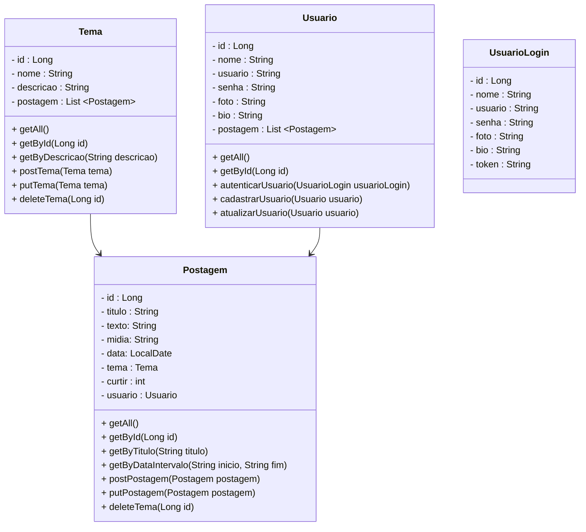

# Back-end
Back-end do projeto
- [x] Criar a Camada Model da Tabela de Temas
- [x] Criar a Camada Repository e Camada Controller de Temas
- [x] Criar a Camada Model, Respository, Controller da Tabela de Postagens
- [x] Criar a Camada Model de Usuario
- [ ] Editar o Pom.xml
- [ ] Criar a Camada de Security
- [ ] Criar a Camada de Service de Usuario
- [ ] Criar a Camada de Repository para a interface de Usuario
- [ ] Criar duas Classes Controller para Usuario

 
<h3 align="center">
DER: Modelo de Entidade-Relacionamento nessa Task:
  

  
</h3>
 
<h4 align="center"> 
	🚧  API 🚀 Em construção...  🚧
</h4>
